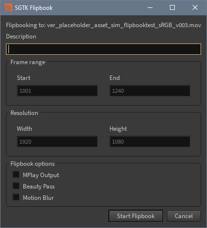
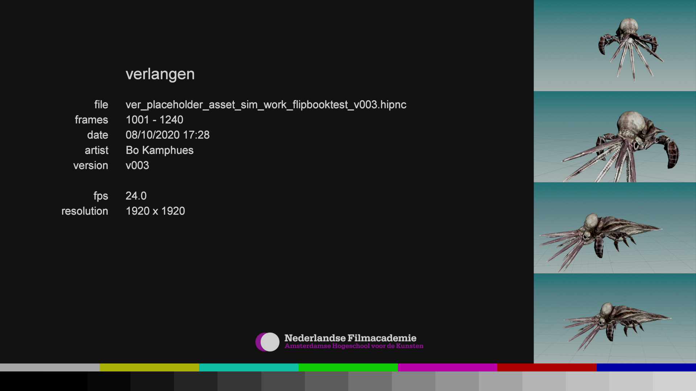

# tk-houdini-flipbook

`tk-houdini-flipbook` is a Shotgun Toolkit app to create flipbooks of your current scene with the use of SGTK templates. It uses Nuke to create a preview file that is automatically uploaded to Shotgun and linked to a new version. `tk-houdini-fipbook` also includes a `slate.py` which mirrors the [tk-multi-reviewsubmission](https://github.com/nfa-vfxim/tk-multi-reviewsubmission) slate. This slate, by default, adds a frame at the beginning of the file to include some data about the version and user. It also adds a small semi-transparent bar at the top and bottom of the screen to reflect some more data.

## Installation
The `tk-houdini-flipbook` app is installed by adding it to your Shotgun Toolkit configuration. Our [pre-build configuration](https://github.com/nfa-vfxim/nfa-shotgun-configuration) already contains said configuration which you are free to fork. For manual configuration, see the list of options:

## Configurations
- `nuke_path`
    - type = `string`
    - default value = `C:/Program Files/Nuke12.2v3/Nuke12.2.exe`
    - Path to your Nuke installation for creating slates (using POSIX forward slashes).
- `work_file_template`
    - type = `template`
    - fields = `context, version, [name]`
    - Template for your current work file in Houdini.
- `review_file_template`
    - type = `template`
    - fields = `version, *`
    - Template for the exported review file.

## Contributing
Pull requests are welcome. For major changes, please open an issue first to discuss what you would like to change.

## License
[MIT](https://choosealicense.com/licenses/mit/)